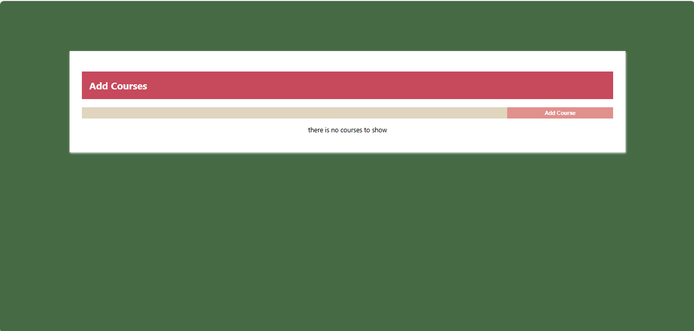

# Todo List Application

This is a simple Crud application built with ReactJs [class-component]. It allows users to add ,edit and delete courses that he want to study or any items. The application uses class components for state management and rendering.

## Table of contents

- [Overview](#overview)
- [Features](#Features)
- [Components](#Components)
  - [App](#App)
  - [CourseList](#CourseList)
  - [CourseForm](#CourseForm)
- [Installation](#Installation)
- [Usage](#Usage)
- [Links](#Links)
- [Screenshot](#Screenshot)
- [What I learned](#what-i-learned)
- [Continued development](#continued-development)
- [Author](#author)
- [Acknowledgments](#Acknowledgments)


## overview
This project is a simple  Crud application built with React.js. It demonstrates the use of class components, state management, and component composition in React. The application allows users to add,edit and remove tasks, providing a straightforward way to manage courses or add daily activities. It serves as an excellent example for those looking to understand and implement React.js concepts in their projects.

## Features
- Add new items and edit it and remove it when finished

## Components

### App

The main component that holds the state and renders the CourseList and CourseForm components.

### CourseList

Displays the list of courses or items and provides an option to edit or delete them.

### CourseForm

Contains a form to add new todo items


## Installation
To get started with this project, follow these steps:

you can clone the project or download it as Zip file.
1. Clone the repository:
   ```bash
   git clone https://github.com/olahasan/CRUD_React-Project_Class-Component

2. Navigate to the project directory:
   cd <project-directory>

3. Install the required dependencies:
   npm install   


## Usage
To run the application, use the following command:

npm start


## Links

If you want to open the link in a new tab, you can:

- Press **Ctrl** (or **Cmd** on Mac) while clicking the link.
- Right-click the link and select **Open link in new tab**.

Otherwise, all links will open in the same tab.


- Solution URL: [here](https://github.com/olahasan/CRUD_React-Project_Class-Component)

- Live Site URL: [here](https://simple-crud-react-classes.surge.sh/)

 ## Screenshot
 



## what-i-learned
Through this project, I learned in this simple project how to create react app and treat with calss component,
how to add,edit and delete item and how to deploy it on Surge.sh

## Continued Development
In the future, I plan to:
- learn reactJs Hooks.

### Author

GitHub - @olahasan

### Acknowledgments

I would like to thank the **[unique coderz academy](https://www.youtube.com/@UniqueCoderzAcademy)** for providing this challenge and to the community for their support.

